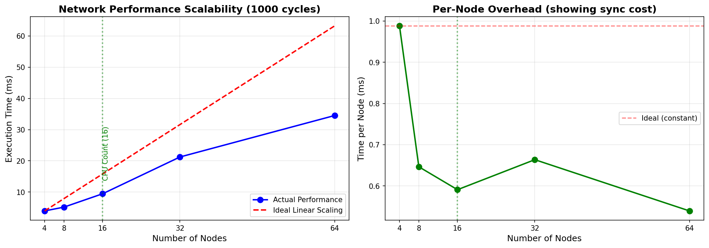

# Network Performance Analysis

## 问题：为什么节点数大于CPU数量时，性能下降严重？

### 性能测试结果

使用benchmark测试不同节点数量的性能（16核心系统）：

| 节点数 | 单次执行时间 (ns/op) | 相对4节点的倍数 |
|--------|---------------------|----------------|
| 4      | 3,952,345          | 1.0x           |
| 8      | 5,171,181          | 1.3x           |
| 16     | 9,453,042          | 2.4x           |
| 32     | 21,235,888         | 5.4x           |
| 64     | 34,518,009         | 8.7x           |

**关键发现**：性能下降不是线性的！当节点数从16增加到32时（2倍），执行时间增加了2.2倍。



**图表说明**：
- 左图：实际性能vs理想线性扩展。绿色虚线标记CPU核心数（16），可以看到超过此数后性能急剧恶化
- 右图：每节点平均开销。理想情况下应该是常量（红色虚线），但实际上随节点数增加而波动，显示同步开销的影响

### 性能瓶颈分析（使用 pprof）

#### 1. CPU Profile 分析

主要耗时函数（累计时间，cum%）：

```
30.00% - Node.Advance/Node.Tick
22.14% - Node.tickQueuesConcurrently
19.29% - runtime.mallocgc (内存分配)
15.71% - Link.Advance/Link.Tick
15.71% - runtime.schedule (goroutine调度)
```

**分析**：
- **Goroutine调度开销**：`runtime.schedule` 占用15.71%，说明goroutine切换成本很高
- **内存分配开销**：`runtime.mallocgc` 占用19.29%，频繁的内存分配导致GC压力

#### 2. Mutex Contention Profile 分析

互斥锁竞争热点：

```
73.93% - runtime._LostContendedRuntimeLock (运行时锁竞争)
26.07% - sync.(*Mutex).Unlock
19.75% - Queue.updateReady (队列就绪状态更新)
18.39% - Queue.ProcessPackets (队列包处理)
 5.91% - Link.ProcessPackets (链路包处理)
```

**分析**：
- **运行时锁竞争严重**：73.93%的竞争来自Go运行时内部锁（主要是调度器锁）
- **Ready状态同步**：Queue的updateReady和ready检查导致大量锁竞争
- **Condition Variable开销**：sync.Cond.Wait/Broadcast占用约2-3%

#### 3. 同步操作开销

```
5.71% - sync.WaitGroup (Add/Done/Wait)
5.00% - sync.runtime_Semacquire (信号量获取)
4.29% - sync.runtime_Semrelease (信号量释放)
2.86% - sync.Cond.Wait (条件变量等待)
```

### 根本原因

当节点数量超过CPU核心数时，性能下降的主要原因：

1. **过度并行（Over-parallelization）**
   - 每个cycle有 `2*nodeCount + linkCount` 个goroutine（节点有input/output队列，每个link一个goroutine）
   - 64个节点 = 约128个goroutine并发执行
   - 16核心需要频繁切换128个goroutine

2. **Goroutine调度开销**
   - Go调度器需要在有限的OS线程上调度大量goroutine
   - 上下文切换成本：保存/恢复寄存器、栈切换、调度器锁竞争
   - 每个cycle都要同步所有goroutine（WaitGroup.Wait）

3. **同步开销占主导**
   - 大量的sync.Cond, sync.Mutex操作
   - Ready状态的检查和更新需要频繁加锁
   - WaitDone/updateReady的条件变量广播导致大量goroutine唤醒

4. **内存分配压力**
   - 每个goroutine有独立的栈（最小2KB）
   - 频繁的channel操作导致堆分配
   - GC压力随goroutine数量增加

5. **锁竞争雪崩**
   - 运行时调度器锁成为瓶颈（73.93%竞争）
   - 当大量goroutine同时竞争少量CPU核心时，调度器本身成为串行瓶颈

### 优化建议

#### 短期优化（Low-hanging fruit）

1. **减少goroutine数量**
   ```go
   // 考虑批处理：每个Node只用1个goroutine，内部串行处理所有队列
   // 而不是每个Queue一个goroutine
   ```

2. **优化Ready检查机制**
   ```go
   // 减少Ready()调用频率
   // 考虑使用缓存或更粗粒度的就绪状态
   ```

3. **减少内存分配**
   ```go
   // 复用packet buffer而不是频繁clonePackets
   // 使用对象池（sync.Pool）缓存临时对象
   ```

#### 中期优化（Architectural changes）

1. **批量处理模式**
   - 不是每个cycle同步所有组件，而是批量处理多个cycle
   - 减少同步点数量

2. **工作窃取调度器**
   - 使用固定数量的worker goroutine（等于CPU核心数）
   - 动态分配node/link任务给workers
   - 避免创建过多goroutine

3. **无锁数据结构**
   - 对于Ready状态，考虑使用atomic操作替代mutex
   - 减少条件变量的使用

#### 长期优化（Research directions）

1. **SIMD并行**
   - 使用向量化处理多个packet
   - 适合纯计算任务

2. **分区策略（Partitioning）**
   - 将网络拓扑分成多个分区
   - 每个分区在独立的OS线程上运行
   - 只在分区边界同步

3. **异步执行模型**
   - 不强制每个cycle的barrier同步
   - 允许组件以不同速度前进
   - 只在必要时同步

### 具体数据示例

以32节点为例：
- 总goroutine数：约64个（32个Node + 32个Link）
- 每个cycle的同步操作：
  - 64个WaitGroup.Done
  - 1个WaitGroup.Wait
  - 约128次Cond.Wait/Broadcast（每个组件2次）
  - 约256次Mutex Lock/Unlock（每个组件4-5次）

在16核系统上，这意味着：
- 平均每个核心处理4个goroutine
- 每个cycle需要约500次同步操作
- 运行1000个cycle = 500,000次同步操作

这就是为什么同步开销成为主导因素！

### Go的性能分析工具

本分析使用的Go工具：

1. **Benchmark测试**
   ```bash
   go test -bench=. -benchtime=10x
   ```

2. **CPU Profiling**
   ```bash
   go test -bench=BenchmarkName -cpuprofile=cpu.prof
   go tool pprof cpu.prof
   ```

3. **Mutex Profiling**
   ```bash
   go test -bench=BenchmarkName -mutexprofile=mutex.prof
   go tool pprof mutex.prof
   ```

4. **Memory Profiling**
   ```bash
   go test -bench=BenchmarkName -memprofile=mem.prof
   go tool pprof mem.prof
   ```

5. **Execution Tracing**
   ```bash
   go test -bench=BenchmarkName -trace=trace.out
   go tool trace trace.out
   ```

6. **在pprof中常用命令**
   ```
   top       - 显示最耗时的函数
   top -cum  - 按累计时间排序
   list funcName - 显示函数源码和耗时
   web       - 生成可视化调用图（需要graphviz）
   ```

### 结论

当节点数量超过CPU核心数时，性能下降的根本原因是**同步开销超过了并行收益**。

关键瓶颈：
1. Goroutine调度开销（15.71%）
2. 运行时锁竞争（73.93%）
3. 内存分配压力（19.29%）
4. 同步原语开销（~15%）

**最有效的优化方向**：减少goroutine数量，降低同步频率，使用更高效的同步机制。
