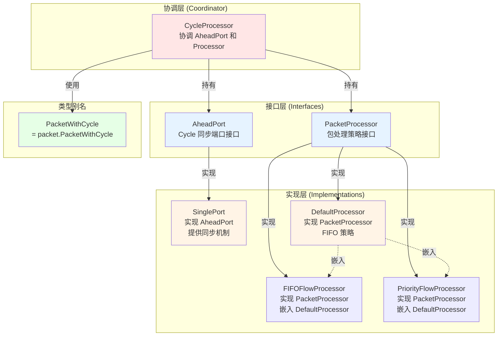

# 架构关系梳理

## 架构关系图



---

## 详细关系说明

### 1. 接口层

#### AheadPort (接口)
- **职责**: 定义基于 cycle 的双向同步通信协议
- **方法**:
  - 上游操作: `SetDone()`, `Chan()`, `Ready()`, `ReadyNonBlocking()`, `GetDone()`
  - 下游操作: `ReceiveChan()`, `WaitForDone()`

#### PacketProcessor (接口)
- **职责**: 定义包处理策略
- **方法**: `ProcessPackets(...)`
- **状态**: 需要存储 `pendingPackets`（因此是接口而不是函数类型）

### 2. 实现层

#### SinglePort (结构体)
- **实现**: `AheadPort` 接口
- **职责**: 提供基于 cycle 的同步通信的具体实现
  - 管理 `doneUntil`（上游完成状态）
  - 管理 `readyUntil` 和 `readyMap`（下游就绪状态）
  - 提供 channel 进行数据传输
  - 提供阻塞/唤醒机制（condition variable）

#### DefaultProcessor (结构体)
- **实现**: `PacketProcessor` 接口
- **职责**: 提供默认的 FIFO 包处理策略
- **状态**: `pendingPackets []PacketWithCycle`（存储未发送的包）

#### FIFOFlowProcessor (结构体)
- **实现**: `PacketProcessor` 接口
- **嵌入**: `*DefaultProcessor`
- **职责**: 在默认处理基础上添加日志

#### PriorityFlowProcessor (结构体)
- **实现**: `PacketProcessor` 接口
- **嵌入**: `*DefaultProcessor`
- **职责**: 优先级处理（当前实现不完整）

### 3. 协调层

#### CycleProcessor (结构体)
- **职责**: 协调 AheadPort 和 Processor
- **持有**:
  - `upstreamPort AheadPort` - 上游端口
  - `downstreamPort AheadPort` - 下游端口
  - `processor PacketProcessor` - 包处理器
- **方法**: `ProcessCycle(cycle int)` - 执行一个 cycle 的处理流程

### 4. 类型别名

#### PacketWithCycle
- **类型**: `packet.PacketWithCycle` 的别名
- **用途**: 表示带 cycle 信息的包

---

## 使用流程

### 创建和使用示例

```go
// 1. 创建端口（实现 AheadPort）
upstreamPort := NewAheadPort(8)      // 返回 *SinglePort，实现 AheadPort
downstreamPort := NewAheadPort(8)    // 返回 *SinglePort，实现 AheadPort

// 2. 创建处理器（实现 PacketProcessor，可选）
processor := &DefaultProcessor{}  // 或 nil（使用默认）

// 3. 创建协调器
cp := NewCycleProcessor(upstreamPort, downstreamPort, processor)

// 4. 处理周期
for cycle := 0; cycle < 10; cycle++ {
    cp.ProcessCycle(cycle)
}
```

### 数据流

```
上游组件
    ↓ SetDone, Chan(), Ready()
AheadPort (接口)
    ↓ 实现
SinglePort (结构体)
    ↓ packetChan
CycleProcessor
    ↓ ReceiveChan(), ProcessPackets()
PacketProcessor (接口)
    ↓ 实现
DefaultProcessor (结构体)
    ↓ sendPacket()
AheadPort (接口)
    ↓ 实现
SinglePort (结构体)
    ↓ packetChan
下游组件
```

---

## 总结

### 架构优点
1. 职责分离清晰：`SinglePort` 负责同步机制，`PacketProcessor` 负责处理策略
2. 支持组合模式：`Processor` 可以嵌入 `DefaultProcessor` 复用逻辑和状态
3. 接口设计合理：解耦、可测试、可扩展

### 命名规范
- `AheadPort` (接口) + `SinglePort` (实现) - 关系清晰
- `PacketProcessor` (接口) + `DefaultProcessor` (实现) - 关系清晰
- `PacketWithCycle` - 表示带 cycle 信息的包

