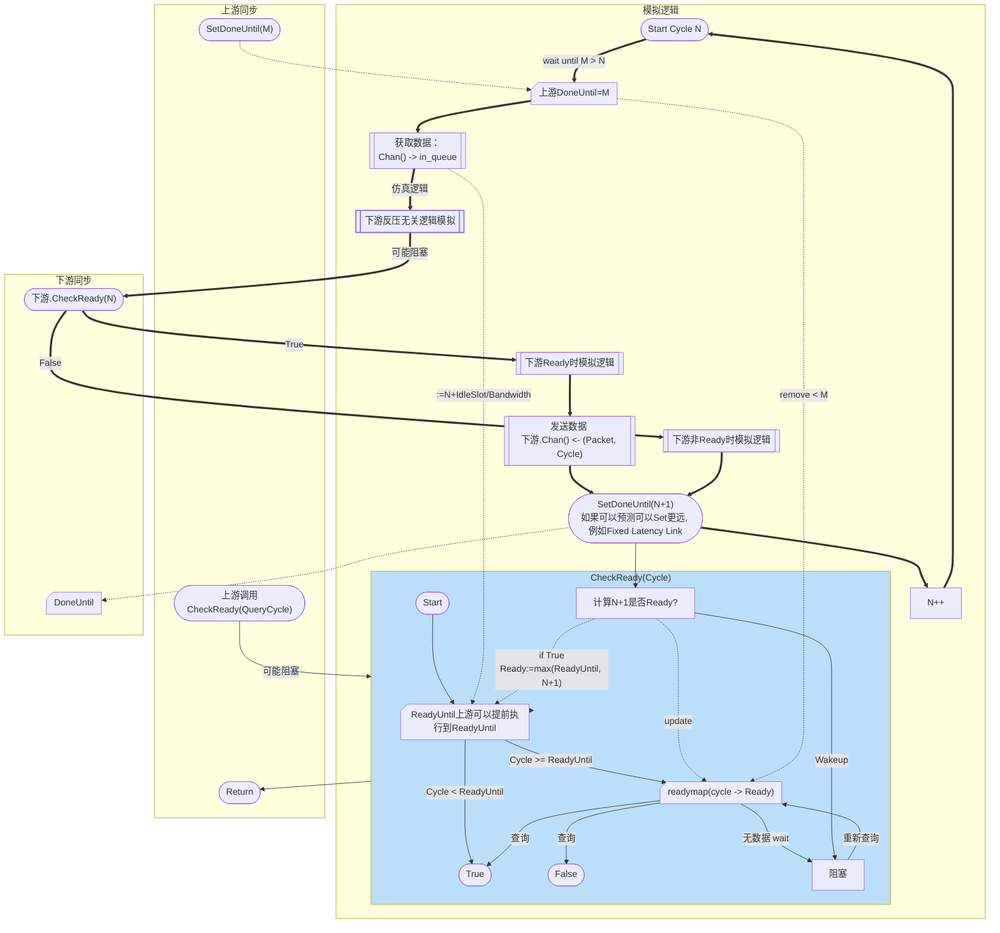

# Flow & Link 同步

Flow 和 Link 之间的交互都使用同一个接口
```go
type ASyncPort interface {
	SetDoneUntil(int)                 // 上游调用，更新 DoneUntil（实现约束，使用Atomic Store）
	Chan() <-chan PacketWithCycle     // 上游调用，获取可 push 的 channel
	Ready(cycle int) bool             // 上游调用，阻塞等待下游计算结果
}
```

Flow -> Link 和 Link -> Flow 都是一样的逻辑。下面，我们按方向称为上游和下游。



在SetDoneUntil前，需要保证所有的包已经通过Chan()中发送完毕。
发包的逻辑是：先CheckReady(cycle) 如果为True，那么发送(packet, cycle);
上游可以配置自身的DoneUntil N，表示自身的N-1的交互已经完成，希望发送的Packet都发送完了。


每个下游开始执行第N Cycle时，需要检查上游的DoneUntil大于等于N。

Link 可以为0 cycle latency。时序图如下，此时
```mermaid
sequenceDiagram
    participant Flow0
    participant Link as "Link Latency 0"
    participant Flow1

    rect
        note right of Flow0: cycle 0
        Flow0->>Link: Set DoneUntil 1
        note right of Link: Release: Link Can finish Cycle 0
        Link->>Flow1: Set DoneUntil 0(cur) + 0(lat) + 1
        note right of Flow1: Flow Can finish Cycle 0
        note right of Link: All Component @ N, wait Src DoneUntil N+1
    end

    rect
        note right of Flow0: cycle 1
        Flow0->>Link: Packet @1, DoneUntil 2
        note right of Link: Release: Link Can finish Cycle 1
        Link->>Flow1: Packet @1, DoneUntil 1(cur) + 0(lat) + 1
        note right of Flow1: Flow Can finish Cycle 1
        note right of Link: All Component @ N, wait Src DoneUntil N+1
    end
```
