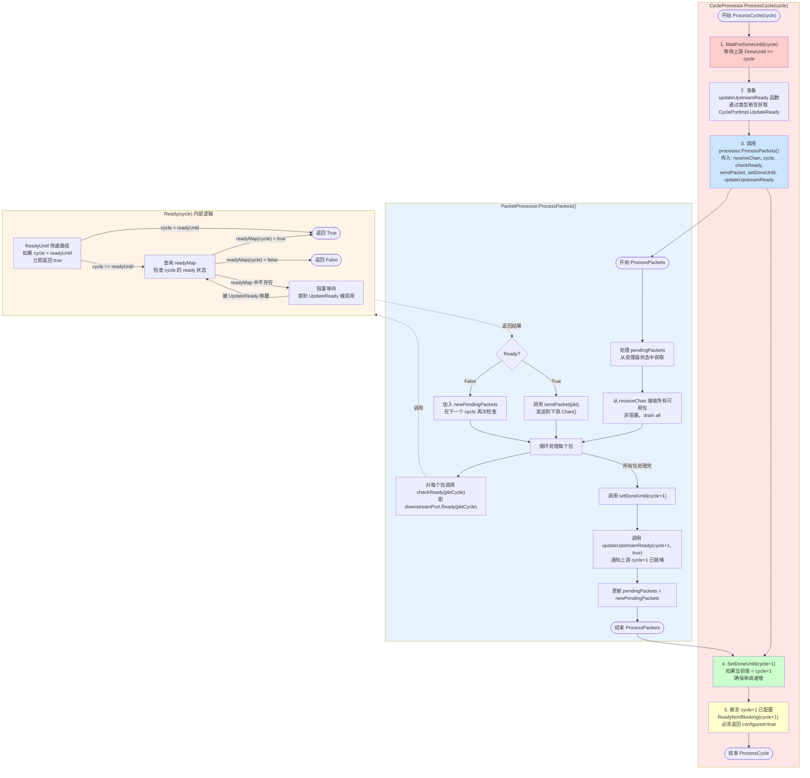
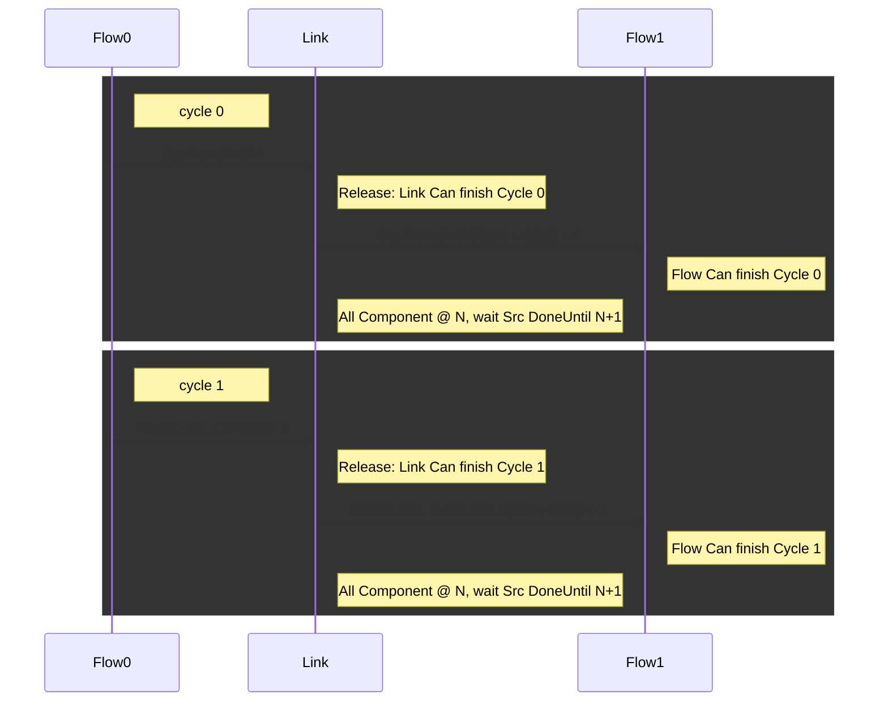

# CyclePort 同步

Flow 和 Link 之间的交互都使用同一个接口
```go
// CyclePort is a bidirectional interface for cycle-based synchronous communication between Flow and Link components.
// A single CyclePort instance provides both upstream and downstream operations:
// - Upstream component (e.g., Flow0) uses upstream operations to send packets and check downstream readiness.
// - Downstream component (e.g., Flow1) uses downstream operations to receive packets and wait for upstream completion.
// This bidirectional design allows the same port to be used from both perspectives, enabling flexible
// composition of Flow and Link components in a dataflow graph.
type CyclePort interface {
	// ===== Upstream Operations =====
	// These methods are called by the upstream component (the sender).

	// SetDoneUntil is called by upstream to notify downstream that it has completed processing up to cycle N-1.
	// DoneUntil N means:
	//   - Upstream has completed cycle N-1
	//   - All packets for cycle N-1 have been sent
	// This uses atomic store for thread-safe updates.
	// Downstream can use WaitForDoneUntil to block until this value reaches a target cycle.
	SetDoneUntil(cycle int)

	// Chan returns a write-only channel for upstream to push packets to downstream.
	// Upstream sends (Packet, Cycle) pairs through this channel.
	// The same channel is accessible to downstream via ReceiveChan().
	Chan() chan<- PacketWithCycle

	// Ready checks if downstream is ready to process the given cycle.
	// Called by upstream before sending a packet for a specific cycle.
	// Returns true if downstream is ready, false otherwise.
	// This method may block waiting for downstream to become ready.
	// Fast path: if cycle < ReadyUntil, returns true immediately.
	// Otherwise, queries readyMap or blocks until downstream signals readiness.
	Ready(cycle int) bool

	// ReadyNonBlocking checks if downstream is ready to process the given cycle without blocking.
	// Returns (ready, configured):
	//   - ready: true if downstream is ready, false otherwise
	//   - configured: true if the cycle is configured (readyMap contains it or readyUntil covers it),
	//                 false if the cycle is not configured and Ready() would block
	// This method never blocks and is useful for assertions and checking configuration status.
	ReadyNonBlocking(cycle int) (ready bool, configured bool)

	// GetDoneUntil returns the current DoneUntil value set by upstream.
	// Can be called by both upstream and downstream to check progress.
	// This is useful for upstream to verify its own progress, or for downstream
	// to check upstream completion status without blocking.
	GetDoneUntil() int

	// ===== Downstream Operations =====
	// These methods are called by the downstream component (the receiver).

	// ReceiveChan returns a read-only channel for downstream to receive packets from upstream.
	// This is the same underlying channel as Chan(), but from downstream's perspective.
	// Downstream reads (Packet, Cycle) pairs from this channel.
	ReceiveChan() <-chan PacketWithCycle

	// WaitForDoneUntil blocks the calling goroutine until upstream's DoneUntil >= targetCycle.
	// Called by downstream at the start of cycle N to ensure upstream has completed cycle N-1.
	// This uses condition variable to avoid busy waiting - the goroutine will block until
	// upstream calls SetDoneUntil with a value >= targetCycle.
	// Returns immediately if DoneUntil >= targetCycle (no blocking needed).
	WaitForDoneUntil(targetCycle int)
}
```

Flow -> Link 和 Link -> Flow 都是一样的逻辑。下面，我们按方向称为上游和下游。

**注意**：`CyclePort` 接口通常与 `CycleProcessor` 和 `PacketProcessor` 配合使用。`CycleProcessor` 提供了标准的 cycle 处理流程，而 `PacketProcessor` 定义了包处理策略。详见 `architecture_relationship.md`。

## CycleProcessor 处理流程

以下流程图展示了 `CycleProcessor.ProcessCycle(cycle)` 的完整执行流程，包括与 `PacketProcessor` 的交互：



### 流程图说明

1. **CycleProcessor.ProcessCycle(cycle)**（红色区域）：
   - 这是框架层，负责协调整个 cycle 的处理流程
   - 步骤 1：等待上游完成（`WaitForDoneUntil`）
   - 步骤 2-3：准备并调用 `PacketProcessor.ProcessPackets()`
   - 步骤 4-5：确保下游 `DoneUntil` 正确设置，并断言上游已配置

2. **PacketProcessor.ProcessPackets()**（蓝色区域）：
   - 这是策略层，由用户自定义或使用 `DefaultProcessor`
   - 处理 `pendingPackets`（之前未发送的包）
   - 从 `receiveChan` 接收所有可用包（非阻塞）
   - 对每个包检查下游是否 ready，ready 则发送，否则保存到 `pendingPackets`
   - 最后通知上游下一个 cycle 已就绪

3. **Ready(cycle) 内部逻辑**（黄色区域）：
   - 展示 `CyclePort.Ready()` 方法的内部实现
   - 快速路径：如果 `cycle < readyUntil`，立即返回 true
   - 否则查询 `readyMap`，如果不存在则阻塞等待

### 关键设计点

- **职责分离**：`CycleProcessor` 负责框架流程，`PacketProcessor` 负责包处理策略
- **非阻塞接收**：`ProcessPackets` 从 channel 非阻塞地接收所有可用包，避免阻塞
- **pendingPackets 机制**：如果下游不 ready，包会保存到 `pendingPackets`，在下一个 cycle 再次检查
- **双向同步**：通过 `SetDoneUntil` 和 `UpdateReady` 实现上下游的双向同步

在SetDoneUntil前，需要保证所有的包已经通过Chan()中发送完毕。
发包的逻辑是：先调用 `Ready(cycle)` 如果为True，那么发送(packet, cycle)。
上游可以配置自身的DoneUntil N，表示自身的N-1的交互已经完成，希望发送的Packet都发送完了。


每个下游开始执行第N Cycle时，需要检查上游的DoneUntil大于等于N。

Link 可以为0 cycle latency。时序图如下，此时

