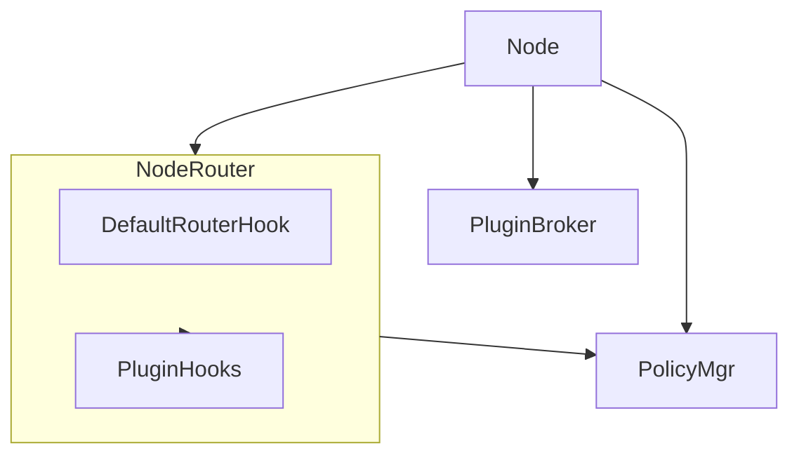

```mermaid
sequenceDiagram
    participant TxFactory
    participant SrcNode
    participant DstNode
    participant PolicyMgr
    participant PluginBroker

    %% Transaction创建
    TxFactory->>PluginBroker: OnTxCreated(tx)
    TxFactory->>SrcNode: AssignTransaction

    %% 路由 & å‘é€
    SrcNode->>PluginBroker: OnBeforeRoute(msg)
    PluginBroker-->>SrcNode: nextHop (default or plugin)
    SrcNode->>PolicyMgr: ResolveRoute(msg)
    PolicyMgr-->>SrcNode: RouteDecision
    SrcNode->>PluginBroker: OnAfterRoute(msg, decision)
    SrcNode->>PluginBroker: OnBeforeSend(msg)
    PluginBroker-->>SrcNode: possibly delay/block
    SrcNode->>DstNode: DeliverMsg
    SrcNode->>PluginBroker: OnAfterSend(msg)

    %% Destination Node处ç†
    DstNode->>PluginBroker: OnBeforeProcess(msg)
    DstNode->>PolicyMgr: DecideConsistency(msg)
    PolicyMgr-->>DstNode: ConsistencyDecision
    DstNode->>PluginBroker: OnAfterProcess(msg)
    PluginBroker-->>DstNode: apply incentives
```

# CHI 协议模拟框架设计文档
---

## 1️⃣ 设计目标

1. **模块解耦**

   * 核心模块：TxFactory、Node、PolicyMgr
   * 所有策略扩展通过统一 Hook（PluginBroker）实现
   * Router 默认逻辑作为 Node 内部 Hook

2. **统一 Hook 系统**

   * FlowControl、节点激励、Router策略、未来QoS/Reliability通过 Hook扩展
   * 核心模块触发 Hook，插件只观察或扩展

3. **最小核心策略**

   * FlowControl必须实现
   * 一致性、路由、DomainMapping核心保留
   * QoS、Reliability、奖励策略通过插件实现

4. **适配 NoC**

   * 每个 Node 内独立路由决策
   * Transaction 生命周期在 Node 内部完成路由和处理

---

## 2️⃣ 顶层架构

```mermaid
flowchart LR
    TxFactory[TxFactory]
    SrcNode[Node (Source)]
    DstNode[Node (Destination)]
    PolicyMgr[PolicyMgr]
    PluginBroker[PluginBroker(Hook System)]

    %% Transaction分配
    TxFactory --> SrcNode

    %% Node内部数据流
    SrcNode --> DstNode
    SrcNode --> PolicyMgr
    DstNode --> PolicyMgr
    SrcNode --> PluginBroker
    DstNode --> PluginBroker

    style PolicyMgr fill:#fef3c7,stroke:#b48b00,stroke-width:2px
    style PluginBroker fill:#f3f0ff,stroke:#9b5de5
```

* **TxFactory**：创建 Transaction 并分配源 Node
* **Node**：内含 Router 默认 Hook、消息发送、处理逻辑
* **PolicyMgr**：一致性、FlowControl、DomainMapping、能力查询
* **PluginBroker**：统一 Hook 注册与触发

---

## 3️⃣ Transaction 生命周期



* **Router默认逻辑**在 Node 内作为 Hook触发
* **FlowControl** Hook在 `OnBeforeSend`执行
* **节点激励** Hook在 `OnAfterProcess`执行

---

## 4️⃣ Node内部结构



* 每个 Node 内部 Router 默认逻辑 + Plugin Hook
* 通过 PluginBroker统一管理 Hook
* PolicyMgr提供一致性、FlowControl、DomainMapping等核心决策

---

## 5️⃣ 消息封装

| 字段          | 类型       | 说明                              |
| ----------- | -------- | ------------------------------- |
| MsgID       | uint64   | 消息唯一标识                          |
| TxID        | uint64   | 所属 Transaction                  |
| Addr        | uint64   | 地址或资源标识                         |
| SrcNode     | string   | 发送节点                            |
| DstNode     | string   | 目标节点                            |
| MsgType     | enum     | 请求/响应/Snoop/Invalidate/Forward  |
| Data        | []byte   | 消息负载                            |
| FlowTag     | optional | FlowControl信息（credits、priority） |
| QoSTag      | optional | QoS标签（未来扩展）                     |
| Reliability | optional | ACK/重传信息（未来扩展）                  |

---

## 6️⃣ 域管理

* **DomainMapping**由 PolicyMgr提供
* 每个地址映射逻辑域，决定一致性范围与路由域
* 插件可查询 Domain信息调整策略

```go
type DomainMapping interface {
    GetDomain(addr uint64) string
}
```

---

## 7️⃣ Hook 系统

### 核心 Hook 点

| 阶段            | Hook名称                                                   | 功能                              |
| ------------- | -------------------------------------------------------- | ------------------------------- |
| TxFactory     | OnTxCreated                                              | 初始化Transaction                  |
| Node(Router)  | OnBeforeRoute / OnAfterRoute                             | 修改或观察路由决策                       |
| Node(Link)    | OnBeforeSend / OnAfterSend / OnReceive                   | FlowControl / QoS / Reliability |
| Node(Process) | OnBeforeProcess / OnAfterProcess / OnConsistencyDecision | 一致性决策及节点激励                      |
| PolicyMgr     | OnDecision                                               | 统一观察或修改策略                       |

### Go实现概览

```go
// RouteContext 在路由阶段传递默认目标与最终目标
type RouteContext struct {
    Packet        *core.Packet
    SourceNodeID  int
    DefaultTarget int
    TargetID      int
}

// MessageContext / ProcessContext 分别用于链路发送与节点处理阶段
type MessageContext struct { Packet *core.Packet; NodeID, Cycle int }
type ProcessContext struct { Packet *core.Packet; NodeID, Cycle int }

// PluginBroker 负责串行触发所有 Hook
func (p *PluginBroker) EmitBeforeRoute(ctx *RouteContext) error { ... }
func (p *PluginBroker) EmitAfterRoute(ctx *RouteContext) error  { ... }
func (p *PluginBroker) EmitBeforeSend(ctx *MessageContext) error { ... }
func (p *PluginBroker) EmitAfterSend(ctx *MessageContext) error  { ... }
func (p *PluginBroker) EmitBeforeProcess(ctx *ProcessContext) error { ... }
func (p *PluginBroker) EmitAfterProcess(ctx *ProcessContext) error  { ... }
```

- **Router默认逻辑**先计算 `DefaultTarget`，Hook 可基于 `RouteContext.TargetID` 进行修改
- **FlowControl** 在 `OnBeforeSend` 之后由 `PolicyMgr.CheckFlowControl` 作最终校验，Hook 可插拔
- **节点激励 / 统计** 在 `OnAfterProcess` 触发，统一记录事件

### RequestNode 生命周期（发送路径）

1. TxFactory 通过 `CreateRequest` 创建事务与请求，触发 `OnTxCreated`
2. `OnBeforeRoute`：插件可调整下一跳或记录指标
3. `PolicyMgr.ResolveRoute`：返回策略决策（默认保留原目标）
4. `OnAfterRoute`：观察最终路由结果，可再次调整
5. `OnBeforeSend`：插件可执行节流、打点，若返回错误则中断发送
6. `PolicyMgr.CheckFlowControl`：校验 credit / token，不通过则跳过发送
7. 节点调用 `Link.Send` 推动消息进入通道
8. `OnAfterSend`：发送后观察、累积统计

### HomeNode 生命周期（转发路径）

1. `defaultRoute` 根据消息类型选择 Slave 或 Master
2. `OnBeforeRoute` / `PolicyMgr.ResolveRoute` / `OnAfterRoute`：允许插件重写返回路径或实现多播
3. `OnBeforeSend` 与 `PolicyMgr.CheckFlowControl`：防止 Relay->Slave 的带宽溢出
4. 调整链路延迟后调用 `Link.Send`
5. `OnAfterSend`：记录转发完成事件

---

## 8️⃣ 优势总结

1. **模块解耦**：核心模块与策略逻辑分离
2. **Router嵌入Node**：符合 NoC，每个节点独立路由
3. **统一Hook系统**：所有策略扩展通过 PluginBroker管理
4. **可扩展**：FlowControl必须，QoS/Reliability/节点激励插件可灵活添加
5. **易调试和可视化**：每个 Hook触发点清晰，支持时间线和拓扑展示

```mermaid
flowchart LR
    %% 核心模块
    TxFactory[TxFactory]
    SrcNode[Node (Source)]
    DstNode[Node (Destination)]
    PolicyMgr[PolicyMgr]
    PluginBroker[PluginBroker(Hook System)]

    %% Transaction分配
    TxFactory --> SrcNode

    %% Node内部结构
    subgraph SrcNodeInternal[SrcNode Internal]
        DefaultRouter[DefaultRouterHook]
        PluginHooks[PluginHooks]
        FlowControlHook[FlowControlHook]
        IncentiveHook[IncentiveHook]
    end

    subgraph DstNodeInternal[DstNode Internal]
        DstDefaultRouter[DefaultRouterHook]
        DstPluginHooks[PluginHooks]
        DstFlowControlHook[FlowControlHook]
        DstIncentiveHook[IncentiveHook]
    end

    %% 核心流程
    SrcNode --> SrcNodeInternal
    DstNode --> DstNodeInternal
    SrcNodeInternal --> PolicyMgr
    DstNodeInternal --> PolicyMgr
    SrcNodeInternal --> PluginBroker
    DstNodeInternal --> PluginBroker
    SrcNodeInternal --> DstNodeInternal

    %% Hook触发说明
    TxFactory -->|OnTxCreated| PluginBroker
    SrcNodeInternal -->|OnBeforeRoute/OnAfterRoute| PluginBroker
    SrcNodeInternal -->|OnBeforeSend/OnAfterSend| PluginBroker
    DstNodeInternal -->|OnBeforeProcess/OnAfterProcess| PluginBroker
    DstNodeInternal -->|节点激励| PluginBroker

    style PolicyMgr fill:#fef3c7,stroke:#b48b00,stroke-width:2px
    style PluginBroker fill:#f3f0ff,stroke:#9b5de5
    style SrcNodeInternal fill:#e0f7fa,stroke:#00796b
    style DstNodeInternal fill:#e0f7fa,stroke:#00796b

```

---

## 9️⃣ 当前实现快照（2025-11）

- **TxFactory**
  - 作为同步装配器，由 `Simulator` 注入 `RequestNode`
  - 负责分配 PacketID、创建事务并触发 `OnTxCreated`
- **PluginBroker**
  - 现支持 `TxCreated / BeforeRoute / AfterRoute / BeforeSend / AfterSend / BeforeProcess / AfterProcess`
  - 所有 Hook 均以串行方式执行，任一返回错误会短路后续 Hook
- **PolicyMgr**
  - 接口：`ResolveRoute`、`CheckFlowControl`、`DomainOf`
  - 默认实现提供空策略，可通过 `WithRouter/WithFlowController/WithDomainMapper` 组合自定义逻辑
- **节点注入**
  - RequestNode：`SetTxFactory`、`SetPluginBroker`、`SetPolicyManager`
  - HomeNode：`SetPluginBroker`、`SetPolicyManager`，转发路径已接入 Hook 与策略
  - SlaveNode：`SetPluginBroker`，在处理前后触发 Hook 并记录事件
- **测试覆盖**
  - `hooks/broker_test.go` 验证 Hook 注册顺序与错误短路
  - `policy/manager_test.go` 验证默认策略与流控拦截

---

## 🔟 插件化骨架（2025-12）

### 核心结构
- **骨架最小化**：`Node` / `Link` 仅负责上下文封装、信号驱动与消息转发；路由、流控、统计等均通过插件实现。
- **上下文传递**：`RouteContext`、`MessageContext`、`ProcessContext` 迁移为通用 DTO，供骨架与插件共享。
- **PluginBroker**：新增插件元数据管理，支持按 `Capability`、`Policy`、`Visualization`、`Instrumentation` 分类。
- **Registry**：`hooks.Registry` 提供全局/节点级插件注册与按配置加载能力，避免在 `Simulator` 中硬编码。

### 能力拆分
- **节点能力包**：`capabilities/` 目录提供标准能力，当前内置：
  - `RoutingCapability`：封装 `policy.Manager.ResolveRoute`，在 `AfterRoute` 阶段重写目标节点。
  - `FlowControlCapability`：封装 `policy.Manager.CheckFlowControl`，在 `BeforeSend` 阶段判定是否阻塞。
  - `HookCapability`：通用 Hook 组合器，支持快速扩展如统计、激励等逻辑。
- **默认注入**：`RequestNode`、`HomeNode`、`SlaveNode` 各自维护 `registerCapability`，实例化后会自动注册默认能力：
  - RN/HN 自动挂载路由 + 流控能力。
  - SN 自动挂载处理前后统计能力（写入 `TransactionManager`）。
- **插拔机制**：能力注册只依赖 `PluginBroker` 描述符，插件可按名称防止重复加载。

### 可视化插件
- 新增 `visual` 包，收敛 `Visualizer` 接口定义与默认 `NullVisualizer`。
- `plugins/visualization` 提供统一注册入口，通过 `hooks.Registry` 动态装配不同可视化实现（目前提供 `web`、`none`）。
- `Simulator.configureVisualizer`：
  - 首次启动时将工厂注册到 Registry。
  - 根据 `Config.Headless` / `Config.VisualMode` 装载插件。
  - 自动注入 `TransactionManager` 并重建运行时桥接。

### 激励插件
- 新增 `plugins/incentives` 注册器，面向激励/奖励逻辑。
- 示例插件：`incentive/random` 在 `OnAfterProcess` 随机触发奖励事件（示例日志）。
- 插件加载遵循配置字段 `Config.Plugins.Incentives`，可在不修改框架代码的情况下堆叠多个激励实现。

### 配置扩展
- `Config` 增加 `Plugins` 字段，用于声明全局插件（目前支持 `Incentives` 列表）。
- 原有模拟器启动流程调整为：
  1. 创建 `PluginBroker` 与 `Registry`。
  2. 调用 `configureVisualizer`、`configureIncentives` 根据配置加载插件。
  3. 节点注入默认能力。
- 配置文档说明补充 `Plugins.Incentives` 的用法，并与 Web 控制命令兼容。

### 目录更新
```
capabilities/                 # 节点能力实现（路由、流控、统计等）
hooks/                        # Hook Broker 与 Registry
plugins/
  ├── incentives/             # 激励插件注册器、示例实现
  └── visualization/          # 可视化插件注册器
visual/                       # Visualizer 接口与 Null 实现
```

### 重构收益
- **关注点隔离**：骨架专注仿真调度与性能，策略/可视化/激励均可独立演进。
- **装配灵活**：开发者可通过配置或 Registry 新增插件，无需修改核心代码。
- **测试简化**：插件可单独做单元测试；骨架层只需验证上下文与 Hook 调度。
- **扩展统一**：`PluginDescriptor` 元数据统一记录插件，Web 或 CLI 可检索已加载能力。