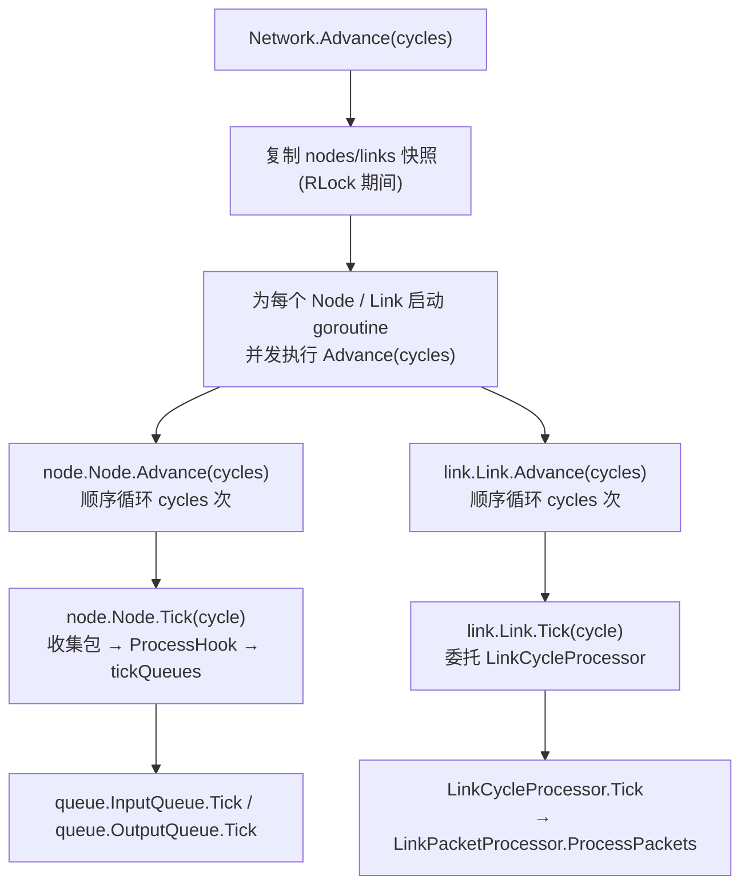

# Network 接口说明

## 目标

1. 统一调度多个 `Node` 与 `Link`，每次调用 `Advance(cycles)` 同步推进指定的 cycle 数。
2. 每条 `Link` 仅连接单个 `Node` 的 `OutputQueue` 与另一 `Node` 的 `InputQueue`，保持 KISS。
3. 提供 Mesh / Ring 等拓扑示例，便于后续扩展测试。

## 核心结构

- `Network`: 维护节点句柄与链路列表。调用 `Advance(cycles)` 时，仅负责并发触发每个 `Node.Advance` / `Link.Advance`，再收敛错误。
- `NodeHandle`: 绑定 `node.Node` 以及若干 `queue.InputQueue` / `queue.OutputQueue`，用于连接。
- `Link`: 轻量延迟模型，保存 `inFlight` 缓冲；每个 Tick 从 `OutputQueue` 取包，经历 `latency` 后写入目标 `InputQueue`。

## 流程

1. `AddNode(handle)`: 注册节点，确保 ID 唯一。
2. `Connect(srcID, srcOutIdx, dstID, dstInIdx, latency, bandwidth)`:
   - 校验队列索引。
   - 构造 `Link`，记录链路走向，默认单带宽。
3. `Advance(cycles)`:
   - Network 仅作为调度器，直接调用 Node/Link 的 `Advance(cycles)`；底层通过 AheadPort/Queue/CycleProcessor 实现异步同步，详见 `cycle_port.md`。

## Advance 调用关系

下面的流程图展示了 `Network.Advance` 一次调用内的关键路径，直到 `Link` 和 `Node` 的 `Tick`：

- 快照阶段保证 `Advance` 在固定拓扑上运行，同时锁保持时间最短。
- `Node.Advance`、`Link.Advance` 内部均是顺序循环 `cycles` 次，每次循环调用各自的 `Tick`。
- `Node.Tick` 完成队列取包、Hook 执行后，会并发触发所有输入/输出队列的 `Tick`，确保上下游同步。
- `Link.Tick` 则交由 `LinkCycleProcessor` 与 `LinkPacketProcessor` 完成等待 `DoneUntil`、插槽调度、带宽/延迟控制。

## 测试

- `TestNetworkAdvanceMesh`：
  - 构造 3 节点 Mesh（0→1→2 及 0→2），验证 `A->B`、`A->C` 包路径。
- `TestNetworkAdvanceRing`：
  - 构造 3 节点环，注入 `ring`，断言回到起点。

运行：`go test -timeout 5s ./internal/core/network`.

