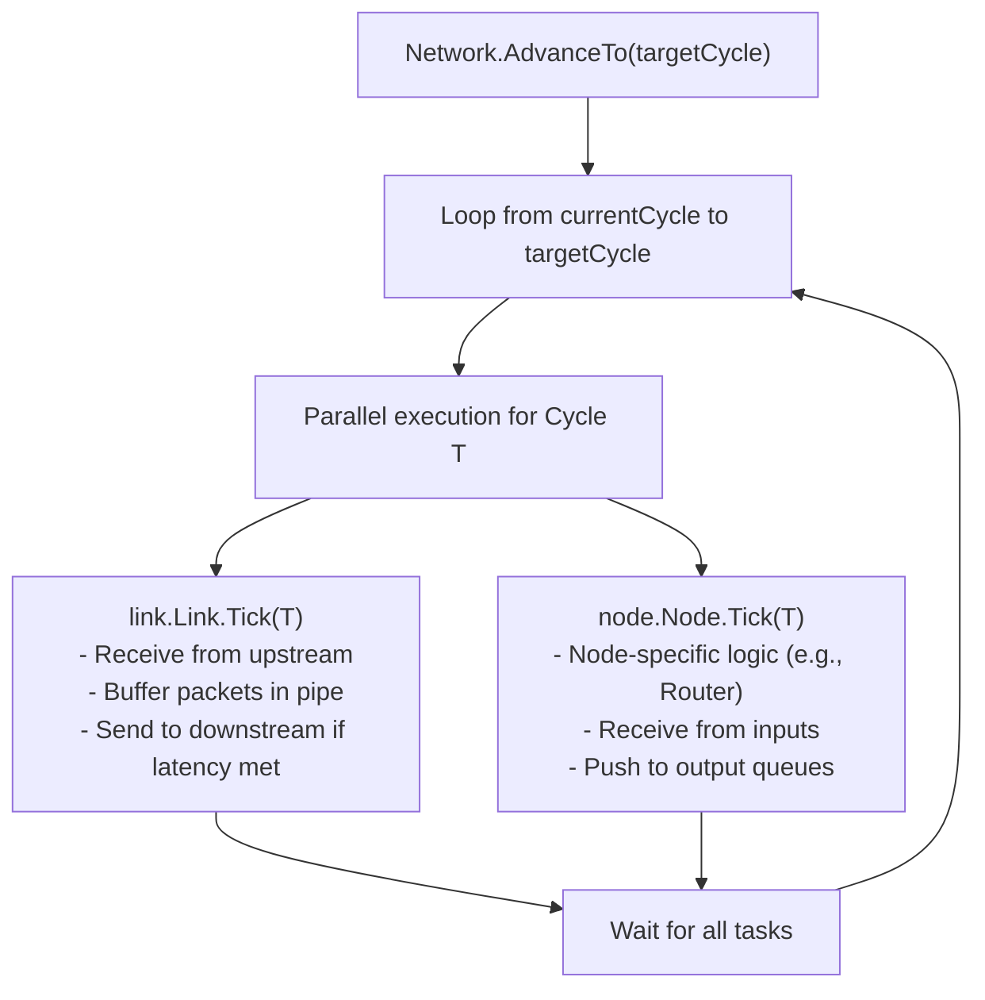

# Network 接口与调度 (Network Interface & Scheduling)

## 核心职责
`Network` (位于 `internal/core/network`) 是仿真引擎的顶层控制器，负责管理组件生命周期和驱动仿真推进。

## 主要 API

### 1. `AddNode(handle *NodeHandle)`
- 将一个已实例化的节点（如 `WorkerNode`）注册到网络中。
- `NodeHandle` 封装了 `Node` 接口实例以及其关联的 `InputQueue` 和 `OutputQueue`。

### 2. `Connect(srcNodeID, srcPortIdx, dstNodeID, dstPortIdx, opts ...ConnectOption)`
- 在两个节点之间建立连接。
- 内部逻辑：
    - 检索源节点的 `OutputQueue` 和目标节点的 `InputQueue`。
    - 创建一个 `Link` 实例来处理物理延迟。
    - 创建两个 `AheadPort`：一个连接 `SrcNode -> Link`，另一个连接 `Link -> DstNode`。
- `ConnectOption`: 支持自定义链路属性，如自定义 `LinkHandler`。

### 3. `AdvanceTo(targetCycle int)`
- 驱动网络推进到目标周期。
- 这是一个阻塞调用，直到所有组件（Node, Link）都完成了 `targetCycle`。
- **调度机制**:
    - Network 维护当前全局周期。
    - 对于目标周期前的每一个 Cycle `T`：
        - 并发触发所有 Link 的 `Tick(T)`。
        - 并发触发所有 Node 的 `Tick(T)`。
        - 使用 `sync.WaitGroup` 等待本周期所有任务完成，再进入下一周期。

## 内部执行逻辑

## 注意事项
- **不可变性**: 在调用 `AdvanceTo` 后，网络拓扑被视为“冻结”，不再允许 `AddNode` 或 `Connect`。
- **错误收敛**: 任何节点或链路在 `Tick` 中产生的错误都会被捕获，并在 `AdvanceTo` 结束时返回第一个遇到的错误。
- **线程安全**: `Network` 本身在 `AdvanceTo` 运行期间是并发驱动组件逻辑的，但其拓扑结构是非并发安全的，应在 `AdvanceTo` 之前完成构建。

