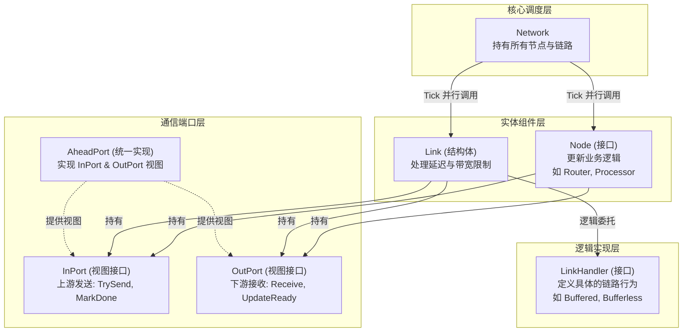

# 组件关系与交互 (Component Relationships & Interactions)

## 核心架构大图

## 关键交互模式

### 1. 端口连接模式 (Port-Based Connection)
`AheadPort` 是连接所有组件的唯一逻辑界面。两组件间建立一个 `Port` 实例，上游看到 `InPort`，下游看到 `OutPort`。
- **Node to Link**: Node 的输出队列通过 `InPort` 连接到 Link 的输入端。
- **Link to Node**: Link 的输出端通过 `InPort` 连接到 Node 的输入队列。

### 2. 委托模式 (Handler Pattern)
`Link` 采用了委托模式。`Link` 本身处理通用的 `Tick` 调度、端口管理和统计，而核心的包处理逻辑（如何缓冲、如何流控）委托给 `LinkHandler` 接口实现：
- **BufferedLinkHandler**: 实现固定延迟、固定带宽和反压。
- **BufferlessLinkHandler**: 无需物理缓冲，直接透传。

### 3. 三阶段 Tick 处理 (Three-Phase Tick)
无论是 `Node` 还是 `Link`，在每个 Cycle `T` 通常遵循以下阶段：
1. **Receive**: 从 `OutPort` 读取 Cycle `T` 的输入包 (如果是 Link 则读取 `T-latency`)。
2. **Process**: 执行业务逻辑或链路调度逻辑。
3. **Emit & Mark**: 将结果发送到下游，并调用 `MarkDone(T)`。

## 数据流动示例 (Node A -> Link -> Node B)

1. **Network** 开启 Cycle `T` 的并行 Tick。
2. **Node A** 在 `Tick(T)` 中产出一个数据包，通过 `InPort.TrySend(T, pkt)` 发送（若 `Link` 的输入端 `Ready`）。
3. **Node A** 处理完后调用 `InPort.MarkDone(T)`。
4. **Link** 在 `Tick(T+Latency)` 中通过 `OutPort.Receive(T)` 拿到该包（此时 `MarkDone(T)` 已触发，`Receive` 不再阻塞）。
5. **Link** 逻辑处理后，通过下游 `InPort.TrySend(T+Latency, pkt)` 将包发给 **Node B**。
6. **Link** 调用 `InPort.MarkDone(T+Latency)`。

## 这种设计的收益
- **高度模块化**: 可以轻松更换 Link 行为而不影响 Node，反之亦然。
- **天然异步性**: 每个组件只与其 Port 交互，不直接引用对端组件，极大地方便了并行化。
- **强类型一致性**: `InPort` 和 `OutPort` 的接口拆分保证了组件不会误用不属于其角色的 API。

