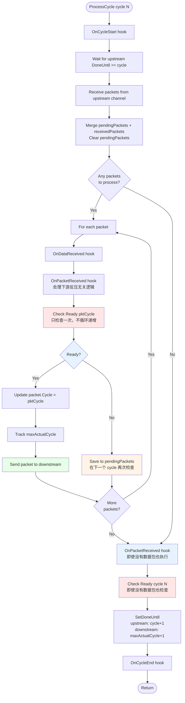
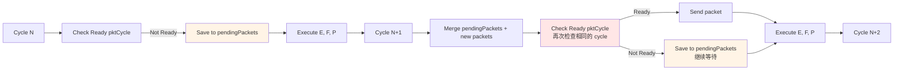

# ProcessCycle 流程图

## 新的逻辑说明

**关键变化**：
- 不再循环递增 cycle
- 如果下游不 ready，数据包保存到 `pendingPackets`
- 在下一个 cycle，优先处理 `pendingPackets` 中的数据包
- 继续执行 E、F、P 步骤，然后进入下一个 cycle

## ProcessCycle 完整流程图



## 跨 Cycle 处理流程



## 详细步骤说明

### 步骤 A: OnCycleStart
- 调用 `OnCycleStart(cycle)` hook
- 标记当前 cycle 开始

### 等待上游 DoneUntil
- 使用 `WaitForDoneUntil(cycle)` 等待
- 使用 `sync.Cond` 避免忙等待
- 阻塞直到上游 `DoneUntil >= cycle`

### 步骤 H: 接收数据包
- 从 `upstreamPort.ReceiveChan()` 接收所有可用数据包
- 使用 `select` 非阻塞接收，直到 channel 为空

### 合并数据包
- 将 `pendingPackets` 和新接收的数据包合并
- 清空 `pendingPackets`（准备接收新的 pending 数据包）

### 处理数据包（如果有）

如果有数据包，对每个数据包执行：

#### OnDataReceived
- 调用 `OnDataReceived(pkt, pktCycle)` hook
- 通知 hook 数据包已接收

#### 步骤 I: 反压无关逻辑（有数据包）
- 调用 `OnPacketReceived(pkt, pktCycle)` hook
- 处理不依赖下游反压的逻辑
- 返回处理后的数据包

#### 步骤 B: 检查下游 Ready（有数据包）
- **只检查一次** `Ready(pktCycle)`
- **不循环递增** cycle
- 调用 `OnDownstreamReady(pkt, pktCycle, isReady)` hook

#### 分支处理

**如果 Ready**:
- 更新 `processedPkt.Cycle = pktCycle`
- 跟踪 `maxActualCycle`
- **步骤 E**: 发送数据包到下游

**如果不 Ready**:
- 保存 `processedPkt` 到 `pendingPackets`
- **不递增** cycle，保持原始 `pktCycle`
- 在下一个 cycle 再次检查相同的 `pktCycle`

### 处理无数据包情况

**即使没有数据包，也要执行以下步骤**：

#### 步骤 I: 反压无关逻辑（无数据包）
- 调用 `OnPacketReceived(nil, cycle)` hook
- 处理不依赖下游反压的逻辑（可能是周期性的逻辑）
- 即使没有数据包，也要执行此步骤

#### 步骤 B: 检查下游 Ready（无数据包）
- 检查 `Ready(cycle)` - 检查当前 cycle 是否 ready
- 调用 `OnDownstreamReady(nil, cycle, isReady)` hook
- 即使没有数据包，也要执行此步骤

### 步骤 F: SetDoneUntil
- `upstreamPort.SetDoneUntil(cycle + 1)`
- `downstreamPort.SetDoneUntil(maxActualCycle + 1)`

### 步骤 P: OnCycleEnd
- 调用 `OnCycleEnd(cycle)` hook
- 标记当前 cycle 结束

## 关键特性

1. **不循环递增**: 如果下游不 ready，不会在当前 cycle 内循环递增，而是保存到 `pendingPackets`
2. **跨 Cycle 处理**: `pendingPackets` 中的数据包会在下一个 cycle 优先处理
3. **保持原始 Cycle**: 数据包的 cycle 保持不变，直到下游 ready
4. **继续执行**: 即使有数据包未发送，仍然执行 E、F、P 步骤

## 示例场景

### 场景 1: 下游不 Ready

```
Cycle 5:
  - 接收数据包 pkt@5
  - 检查 Ready(5) → false
  - 保存到 pendingPackets
  - 执行 E, F, P

Cycle 6:
  - 合并 pendingPackets (包含 pkt@5) + 新数据包
  - 检查 Ready(5) → false (仍然不 ready)
  - 保存到 pendingPackets
  - 执行 E, F, P

Cycle 7:
  - 合并 pendingPackets (包含 pkt@5) + 新数据包
  - 检查 Ready(5) → true (现在 ready)
  - 发送 pkt@5 (cycle 仍然是 5)
  - 执行 E, F, P
```

### 场景 2: 下游 Ready

```
Cycle 5:
  - 接收数据包 pkt@5
  - 检查 Ready(5) → true
  - 发送 pkt@5
  - 执行 E, F, P
```

### 场景 3: 没有数据包

```
Cycle 5:
  - 没有接收数据包
  - 执行 OnPacketReceived(nil, 5)
  - 检查 Ready(5)
  - 执行 E, F, P
```

## 代码位置对应

- **步骤 A**: 第 58-60 行
- **等待上游**: 第 63-66 行
- **步骤 H**: 第 68-79 行
- **合并数据包**: 第 82-86 行
- **OnDataReceived**: 第 98-101 行
- **步骤 I**: 第 103-109 行
- **步骤 B**: 第 111-116 行
- **Ready 分支**: 第 118-134 行
- **步骤 E**: 第 128-129 行
- **保存 pending**: 第 131-134 行
- **步骤 F**: 第 137-141 行
- **步骤 P**: 第 148-151 行
